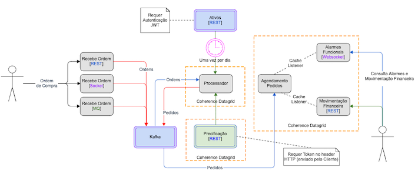

# PricingHub

## Setup do ambiente

1. Execute Minikube

       minikube config set memory 16324
       minikube config set cpus 6
       minikube -p pricinghub start
       minikube profile pricinghub
       minikube addons enable ingress

2. Execute o script de deployment dos componentes no Minikube

        ./deployservices.sh

    Este scrip irá criar as imagens docker e fazer o deploy dos serviços no Kubernetes

## Formas de testar a solução:

É possível abrir o [Apache JMeter](https://jmeter.apache.org/) executando o script:

        $ cd jmeter/
        jmeter$ ./open-jmeter.sh

O JMeter abrirá um [plano de testes](jmeter/PlanoTeste.jmx) que enviará uma [sequência de ordens de compra](jmeter/ordemCompra.csv) para o componente [recebepedidos]().

Se você quiser testar individualmente cada endpoint, Também é possível fazê-lo utilizando o `Insomnia` clicando no botão abaixo:

## Visualição das mensagens no Kafka

Este projeto faz deploy do [Kafdrop – Kafka Web UI](https://github.com/obsidiandynamics/kafdrop).

Para abrir o Kafdrop execute os seguintes comandos:

        $ ./open-kafdrop.sh

## Documentação arquitetura

A arquitetutara da solução, bem como algumas considerações da implementação está descrita no documento [./docs/README.md](./docs/README.md).

Abaixo é possível ter uma idéia dos compoentes e seus papéis na solução:

