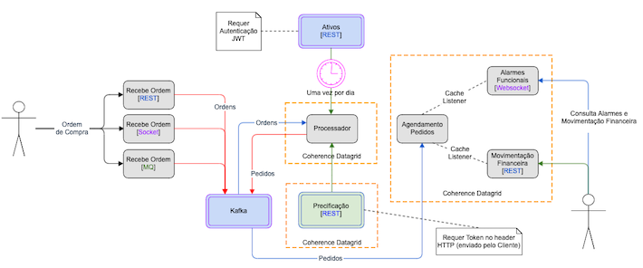

# Documentação básica do Pricing Hub

A PricingHub é uma empresa responsável por processar compras de ativos extremamente voláteis. A empresa recebe ordens de compras de diferentes sistemas (mobile, clientes especializados e clientes internos), cada um com seu respectivo volume e modelo de integração. 

Cada ordem de compra desses clientes é precificada e processada da seguinte forma:

1. Cliente envia uma ordem de compra para um determinado ativo. O pedido contém o nome do ativo, a quantidade e um token que identifica o cliente naquele momento. Se este ativo for enviado via REST, o formato do objeto JSON para envio é:

```json
{
	"versao": "V1",
	"ordemCompra": {
		"nomeAtivo": "Teste",
		"quantidade": 1,
		"tokenCliente": "dasdad"
	}
}
```

2. O processador de ordens avalia qual é o código de precificação do ativo no dia, que pode variar entre `MB`, `B`, `N`, `C`, `MA`. Essa informação está disponível nas informações cadastrais que mudam apenas no batch noturno e é disponibilizada para você em forma de arquivo delimitado. Portando o processador possui um [Job Quartz](http://www.quartz-scheduler.org/) que obtem a lista de ativos uma vez por dia. Para obter a lista de ativos, é necessário informar um Token [JWT](https://jwt.io/).

3. O processador precisa recuperar os preço do ativo que é fornecido pelo sistema de precificação. Um token de clientes e o código de precificação por ativo te darão o preço do ativo naquele momento. A precificação pode ser acessada via API rest. 

4. Uma vez que tem-se o preço do ativo naquele momento, o processador sensibiliza o agendamento de pedidos em uma tópico do Kafka. Os pedidos agendados são persitidos em um Cache do [Oracle Coherence](https://github.com/oracle/coherence). Por se tratar de uma persistência em memório, objetos de Pedidos duplicados serão descartados. Um pedido é considerado igual se possuir o mesmo cliente, e a mesma quantidade do mesmo ativo.

5. Todos os clientes, independente da forma como enviam ordens, tem acesso a um mobile device. Os alarmes são disponibilizados via `Websocket`, de forma que o Alarme se torna visível na hora de sua ocorrência. Apesar de ser pedido que o Alarme seja para os clientes caso o volume financeiro de ordens em uma janela de 30 minutos seja maior que R$ 50 milhões, para esta demo o valor configurado nos valores `janelaTempoSegundos` e `limiteValorAlarme` do serviço [alarmes-funcionais](../alarmes-funcionais) são de R$ 50,00 em 10 segundos.

6. Por fim, é disponibilizado uma API para consulta de volume financeiro por cliente near real time.

Abaixo é possível ver o diagrama da solucação implementada.



## Considerações arquiteturais

- A variação de fluxo de mensagens no tempo pode chegar a picos de 10Bi mensagens/dia. Neste caso, partes da arquitetura como os serviços `recebepedidos`, `processador`, etc; podem ser escalados para atender  a nova demanda. Funcionalidades como o [Kubernetes Horizontal Pod Autoscaler](https://kubernetes.io/docs/tasks/run-application/horizontal-pod-autoscale/) podem permitir ainda que todos os serviços da arquitetura sejam escalados automaticamente.

-  A garantia de processamento é obtida através de diversos mecanismos como:
    - A possibilidade de execução de várias réplicas para um mesmo serviço
    - Possibilidade de uso do [Kubernetes Health checks](https://kubernetes.io/docs/tasks/configure-pod-container/configure-liveness-readiness-startup-probes/)
    - Clusterização dos componentes do [Apache Kafka](https://kafka.apache.org/) e do [Oracle Coherence](https://github.com/oracle/coherence)

- O uso do [Kubernetes Health checks](https://kubernetes.io/docs/tasks/configure-pod-container/configure-liveness-readiness-startup-probes/) em conjunto com o [MicroProfile Health](https://helidon.io/docs/latest/#/mp/health/01_introduction) permite observar a saúde dos componentes e ainda permitir que componentes não saudáveis não recebam requisição, sendo imediatamente substituídos por novas réplicas saudáveis.
    - Outras métricas da aplicação podem ser obtidas com o a API do [MicroProfile Metrics](https://helidon.io/docs/latest/#/mp/metrics/01_introduction)

- As mensagens são consideradas duplicadas se forem `a mesma quantidade`, do `mesmo ativo` para o `mesmo cliente`, A implementação dos métodos `equals()` e `hashcode()` para a Classe `Pedido` impede automáticamente que haja duas cópias do mesmo Pedido no Cache distribuído em memória.

- O cálculo do volume financeiro por cliente, bem como os alarmes em real time são feitos utilizando o [Apache Flink](https://ci.apache.org/projects/flink/flink-docs-release-1.13/. As informações sobre os `alarmes` e `volumes financeiros` são colocados no Datagrid à medida que são computados.
    - Um Cache listener atualiza todos os clientes via websockets quando um alarme novo é colocado no datagrid.
    - Quando o websocket para um cliente é aberto, o cache é consultado para verificar se há algum alarme em vigor.

- Independente do modelo de entrada (REST, Socket, MQ), as entradas são convertidas em um objeto Java que é serializado no Apache Kafka para ser processado pelo `Processador`.

No diagrama abaixo é possível revisar a arquitetura descrita com mais detalhes:


## Considerações sobre a implementação

- O componente `recebepedidos` recebe os pedidos via `REST` (na porta 8080) e `SOCKET` (na porta 5000). Entretanto seria interessante quebra-los em componentes como `recebepedidos-rest` e `recebepedidos-socket`.  Isto não foi feito para diminuir a quantidade de processos em execução no ambiente de teste.
    - O protocolo `MQ` não foi implementado.

- Os componente `alarmes-funcionais` também agrega as funcionalidades de `Alarmes` e `Movimentação financeira` para diminuir a quantidade de processos em execução no ambiente de teste.

- Arquivo com o cadastro de ativos pode ser armazenado em um volumen externo, configurável através do parâmetro `arquivo`. 
    - Para acessar o cadastro de ativos, é necessário informar um JWT assinado usando o algorítimo RS256.
    - O Download do arquivo é compactado e enviado em pedaços (Chunked) para possibilitar o download de até 2GB via HTTP.

- Para obter a precificação, foi pedido que o token do cliente seja enviado. No entando o mesmo não foi usado para qualquer processamento/autenticação.
    - Durante a inicialicação do componente de `precificacao`, alguns valores padrões são inseridos. Este comportamento é definido pelo parâmetro `carregaPrecoPadrao`.

- Se durante o processamento, não foi possível obter o preço, ou existir qualquer outro motivo que impeça o processamento da Ordem, esta será enviada para uma fila chamada `ordens-compra-naoprocessada`.  Um Header com a causa da falha será adicionado à ordem.

- O trigger do alarme do limite de movimentação financeira foi definido como R$ 50,00 em 10 segundos apenas para facilitar o teste e a validação da implementação. Estes valores podem ser configurados através dos parâmetros `janelaTempoSegundos` e `limiteValorAlarme` do serviço [alarmes-funcionais](../alarmes-funcionais)
    - O alarme é disponbilizado via `websocket`

- Nenhum banco de dados (SQL ou NOSQL) foi utilizado. As informações foram colocadas em um Datagrid.

- Os nomes utilizados nas classes, métodos e variáveis foram em Português para criar uma [linguagem ubíqua](https://www.linkedin.com/pulse/domain-driven-design-linguagem-ub%C3%ADqua-veranildo-veras/?originalSubdomain=pt).